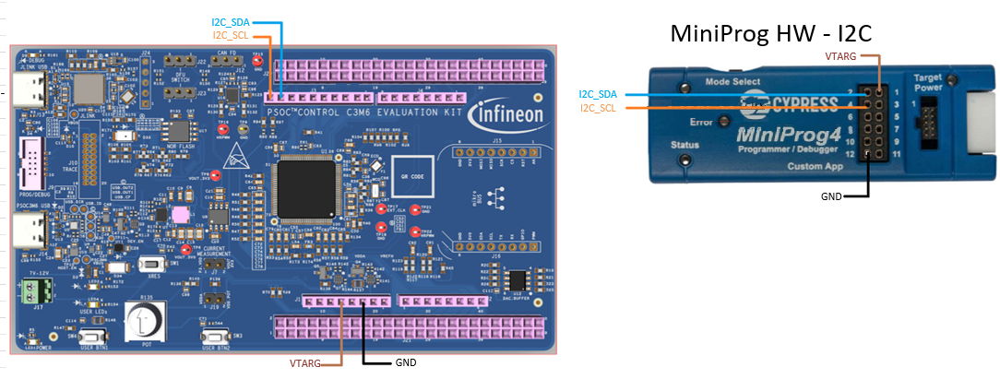
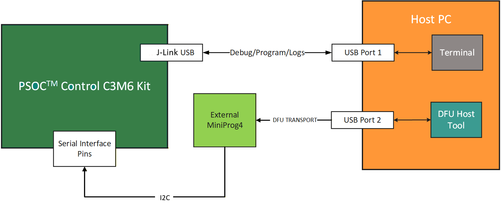
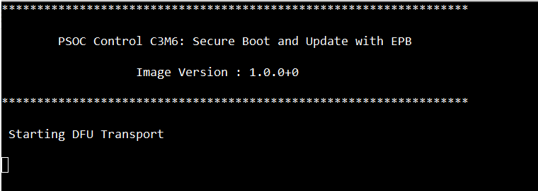
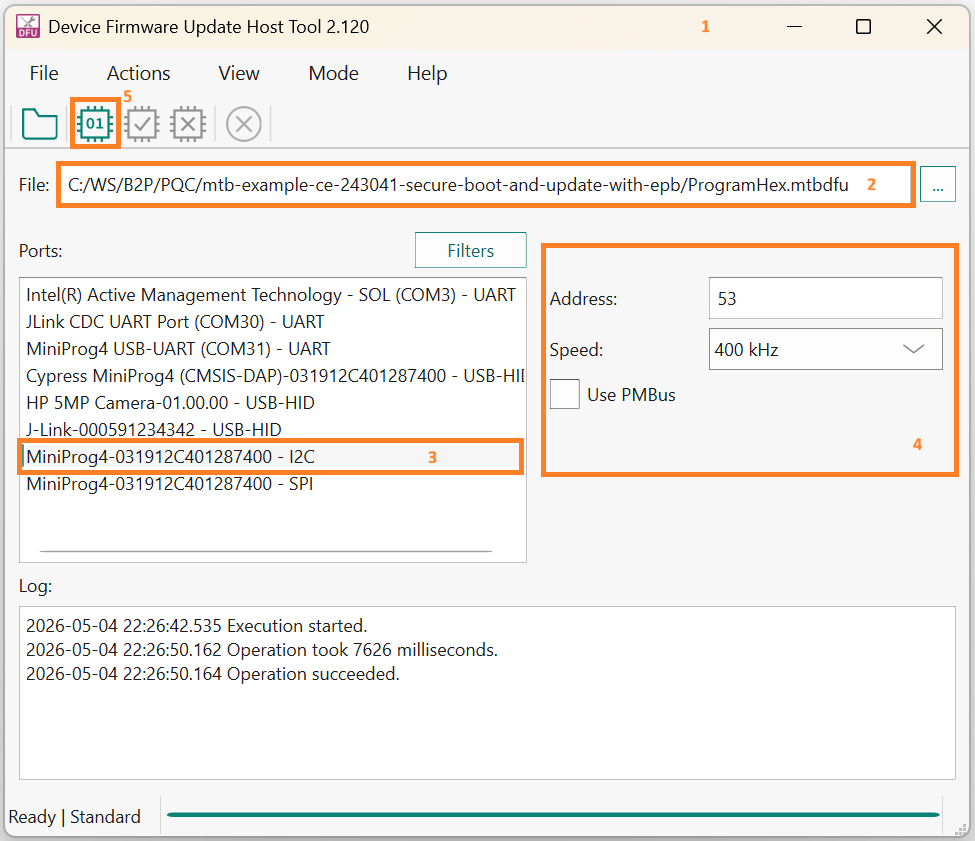
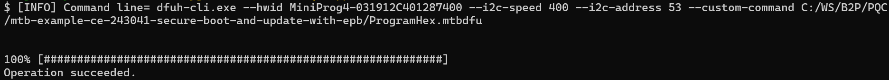
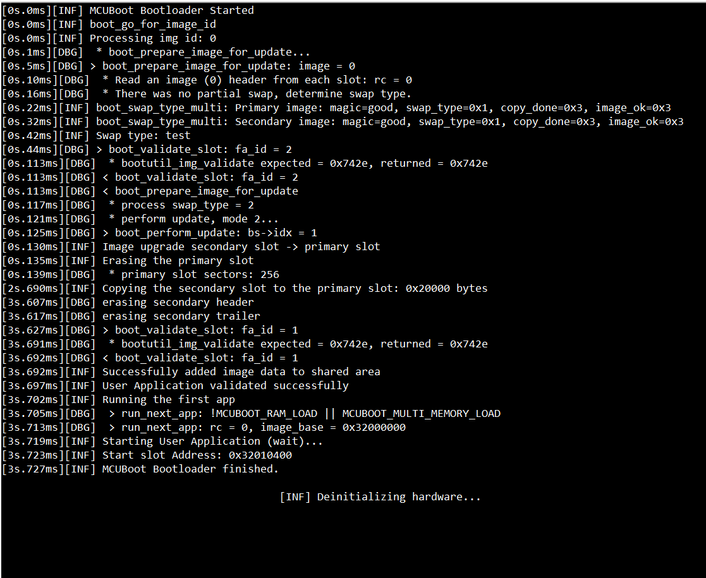
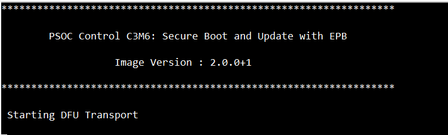

# PSOC&trade; Control C3 MCU: Secure Boot and update with EPB

This code example demonstrates secure boot and secure firmware update on the PSOC&trade; Control C3M6 MCU using the Edge Protect Bootloader (EPB). Application images are signed and authenticated using either post-quantum cryptography (XMSS_SHA2_10_256, LMS_SHA256_M32_H10, ML-DSA-44/65/87) or classic elliptic-curve cryptography (ECDSA-256, ECDSA-384, ECDSA-521), ensuring integrity and authenticity at boot and during updates. Firmware is downloaded over Infineon's Device Firmware Update (DFU) middleware.

This README is organized around three demonstrations that build on the same base workflow:

1. **Secure boot and update of the application** — Sign the application, configure the EPB to authenticate it, and perform a firmware update over DFU. This is the base flow; the other two demonstrations reuse its steps
2. **Encrypted update** *(optional)* — Additionally encrypt the update image using one of two schemes (EC256 or KDF-CMAC). See the optional note at the end of [Operation](#operation)
3. **Secure boot of the Edge Protect Bootloader** *(optional)* — Sign the EPB and provision the device so the BootROM authenticates the EPB itself before launching it. See the optional note at the end of [Operation](#operation)

> **Note:** Secure boot and update of the application requires **no device provisioning**. Device provisioning — and the [ownership transfer](docs/ownership_transfer.md) that must precede it — is required only for KDF-CMAC encrypted update and for secure boot of the EPB. These two are independent and can be enabled individually.

See the [Design and implementation](docs/design_and_implementation.md) for the functional description of this example.

[View this README on GitHub.](https://github.com/Infineon/mtb-example-ce243041-secure-boot-and-update-with-epb)

[Provide feedback on this code example.](https://yourvoice.infineon.com/jfe/form/SV_1NTns53sK2yiljn?Q_EED=eyJVbmlxdWUgRG9jIElkIjoiQ0UyNDMwNDEiLCJTcGVjIE51bWJlciI6IjAwMi00MzA0MSIsIkRvYyBUaXRsZSI6IlBTT0MmdHJhZGU7IENvbnRyb2wgQzMgTUNVOiBTZWN1cmUgQm9vdCBhbmQgdXBkYXRlIHdpdGggRVBCIiwicmlkIjoidmluYXkucmFuZ2Fzd2FteUBpbmZpbmVvbi5jb20iLCJEb2MgdmVyc2lvbiI6IjEuMC4wIiwiRG9jIExhbmd1YWdlIjoiRW5nbGlzaCIsIkRvYyBEaXZpc2lvbiI6Ik1DRCIsIkRvYyBCVSI6IklDVyIsIkRvYyBGYW1pbHkiOiJQU09DIn0=)

## Requirements

- [ModusToolbox&trade;](https://www.infineon.com/modustoolbox) v3.8 or later
- Board support package (BSP) minimum required version for:
   - KIT_PSC3M6_EVAL: v1.0.0
- Programming language: C
- Associated parts: [PSOC&trade; Control C3 MCU](https://www.infineon.com/products/microcontroller/32-bit-psoc-arm-cortex/32-bit-psoc-control-arm-cortex-m33-mcu) parts


## Supported toolchains (make variable 'TOOLCHAIN')

- GNU Arm&reg; Embedded Compiler v14.2.1 (`GCC_ARM`) – Default value of `TOOLCHAIN`
- Arm&reg; Compiler v6.22 (`ARM`)
- IAR C/C++ Compiler v9.70.4 (`IAR`)


## Supported kits (make variable 'TARGET')

- [PSOC&trade; Control C3M6 Evaluation Kit](https://www.infineon.com/KIT_PSC3M6_EVAL) (`KIT_PSC3M6_EVAL`) – Default value of `TARGET`


## Hardware setup

This example uses the board's default configuration. See the kit user guide to ensure that the board is configured correctly.

1. Make the following connections shown in **Figure 1** to use I2C DFU Transport:

    **Figure 1. Sample I2C interface connection**

    

2. Connect onboard J-Link to the PC

    While both J-Link and MiniProg4 (external) must be connected to the PC, do not connect the MiniProg4 USB to the host PC yet – wait until you are instructed to do so later in this README

    **Figure 2** shows the sample hardware connection required for the example:

    **Figure 2. Sample hardware connection for I2C**

    


## Software setup

See the [ModusToolbox&trade; tools package installation guide](https://www.infineon.com/ModusToolboxInstallguide) for information about installing and configuring the tools package.

<details><summary><b>ModusToolbox&trade; Edge Protect Security Suite</b></summary>

1. Download and install the [Infineon Developer Center Launcher](https://www.infineon.com/cms/en/design-support/tools/utilities/infineon-developer-center-idc-launcher)

2. Login using your Infineon credentials

3. Download and install the “ModusToolbox&trade; Edge Protect Security Suite” from Developer Center Launcher
   
    > **Note:** The default installation directory of the Edge Protect Security Suite in Windows operating system is *C:/Users/`<USER>`/Infineon/Tools*
   
4. After installing the Edge Protect Security Suite, add the Edge Protect tools executable to the system PATH variable
    
   Edge Protect tools executable is located in *<Edge-Protect-Security-Suite-install-path>/ModusToolbox-Edge-Protect-Security-Suite-`<version>`/tools/edgeprotecttools/bin*

</details>

<details><summary><b>SEGGER J-Link tools</b></summary>

1. Download and install SEGGER J-Link tools (latest version) from [J-Link](https://www.segger.com/downloads/jlink/)

    > **Note:** The default installation directory of the J-Link tools in Windows operating system is *C:/Users/`<USER>`/Infineon/Tools*.

2. After installing the J-Link, add the J-Link executable to the system PATH variable

</details>

Install a terminal emulator if you do not have one. Instructions in this document use [Tera Term](https://teratermproject.github.io/index-en.html).

Install Python if not installed already – download from [Python.org](https://www.python.org/downloads/).

This example requires no additional software or tools.

## Operation

This procedure covers secure boot and update of the application the [encrypted update](docs/setup.md#2-encrypted-update) and [secure boot of the Edge Protect Bootloader](docs/setup.md#3-secure-boot-of-the-edgeprotect-bootloader) demonstrations build on it (see the optional notes at the end of this section).

See [Using the code example](docs/using_the_code_example.md) for instructions on creating a project, opening it in various supported IDEs, and performing tasks, such as building, programming, and debugging the application within the respective IDEs.

1. Connect the board to your PC using the provided USB cable through the J-Link USB connector

2. Open a terminal program and select the J-Link COM port. Set the serial port parameters to 8N1 and 115200 baud

3. Add the [Edge Protect Bootloader](https://github.com/Infineon/mtb-example-ce43373-edgeprotect-bootloader) project to your workspace by following the steps in [Using the code example](docs/using_the_code_example.md). When the guide asks you to choose a code example, select the *PSOC Control C3M6 MCU Edge Protect Bootloader* (or, if using the CLI, specify the repository *mtb-example-ce43373-edgeprotect-bootloader*). After the project is created, open it in your preferred supported IDE as described

4. Complete the [secure boot and update setup](docs/setup.md#1-secure-boot-and-update-of-the-application) — generate/import the image signing key and configure the Edge Protect Bootloader to validate application images

5. Build and Program the CE application image and Edge Protect Bootloader image to the device. After programming, the application should start automatically. Confirm "PSOC Control C3M6: Secure Boot and Update with EPB" is displayed on the UART terminal along with the version "Image Version : 1.0.0+0". Also, confirm that the user LED blinks at approximately 1000 ms and has started the DFU transport for receiving an update image

    **Figure 3. Terminal output on program startup**

    

6. Build an update image to be transferred to the device to perform the firmware update

    1. Open the file *\<Workspace>/\<app-directory>/Makefile*

    2. Change `IMG_TYPE` to `UPDATE`. This change is required to relocate the application images to the shared slots
        > **Note:** This will automatically change the image version details as shown below
        ```
        IMG_VER_MAJOR=2
        IMG_VER_MINOR=0
        IMG_REVISION=0
        IMG_BUILD_NO=1
        ```

    3. Clean build the project to generate the update image

        > **Note:** Do not program this image using J-Link

7. Download the update image to the device and launch the Edge Protect Bootloader to perform the firmware update

    1. The *mtbdfu* file with the appropriate command sequence to transfer the update image is provided in *\<Workspace>/\<app-directory>/ProgramHex.mtbdfu*. Open the file and update the `dataFile` field in the "commands" section with the absolute path of the project hex file *\<Workspace>/\<app-directory>/build/last_config/mtb-example-ce243041-secure-boot-and-update-with-epb_update.hex*

    2. Ensure you have made the MiniProg4 I2C connection as described in the [Hardware setup](#hardware-setup) section, then connect the MiniProg4 to the PC via USB

    3. Download the firmware using either the DFU Host Tool GUI or CLI

        <details><summary><b>Using DFU Host Tool GUI</b></summary>

        1. Open *dfuh-tool.exe* located at *\<install-path>/ModusToolbox/tools_x.y/dfuh-tool*
        2. Select *`<Workspace>/<app-directory>`/ProgramHex.mtbdfu* as the input file to DFU Host Tool
        3. Select the I2C interface
        4. Configure the I2C interface shown in **Figure 4**
        5. Click on *Execute* button to start the image download

            **Figure 4. DFU Host Tool GUI**

            

        </details>

        <details><summary><b>Using DFU Host Tool CLI</b></summary>

        1. Open the modus-shell terminal and move to DFU Host Tool directory (*[install-path]/ModusToolbox/tools_x.y/dfuh-tool*)

        2. Execute the following DFU CLI command from the Host Tool directory in the shell terminal:

            ```
            dfuh-cli.exe --custom-command path-to-mtbdfu-file --hwid Probe-id/COM Port  --interface-params 
            ```

            For example, to use I2C interface, use:

            ```
            dfuh-cli.exe --custom-command `<Workspace>/<app-directory>`/ProgramHex.mtbdfu --hwid MiniProg4-151D0D2303210400 --i2c-speed 400 --i2c-address 53
            ```

            **Figure 5. Console output of DFU Host Tool CLI**

            

        </details>

        > **Note:** See [DFU Host Tool for ModusToolbox&trade; User Guide](https://www.infineon.com/ModusToolboxDFUHostTool) for more details on each of the interfaces

    4. After successful download of the update image to the device, application triggers a system reset to launch the Edge Protect Bootloader for performing the update

       **Figure 6. Terminal output of image update**

       


8. After firmware update is complete, confirm that the core is running the new image – "PSOC Control C3M6: Secure Boot and Update with EPB" is displayed on the UART terminal along with the version "Image Version : 2.0.0+1". Also confirm that the user LED blinks at approximately 1000 ms and the device has restarted DFU transport for receiving a further update image.

    **Figure 7. Terminal output of updated image**

    

> **Note (Optional):**  
**Encrypted update:** To deliver the update image as ciphertext, complete the [Encrypted update setup](docs/setup.md#2-encrypted-update) (EC256 or KDF-CMAC), then repeat **steps 6–8** to build and download the update. The combined update hex is now signed **and** encrypted; the bootloader transparently decrypts it while promoting it to the primary slot.  
**Secure boot of the Edge Protect Bootloader):** To make the BootROM authenticate the bootloader itself, complete the [secure boot of the Edge Protect Bootloader setup](docs/setup.md#3-secure-boot-of-the-edgeprotect-bootloader) to sign the bootloader and provision the device, then repeat **steps 5–8**, programming the signed Edge Protect Bootloader in place of the standard one. On each boot, the BootROM authenticates the EPB image before launching it.

## Related resources

Resources  | Links
-----------|----------------------------------
Documentation | [PSOC&trade; Control C3 MCU documents](https://documentation.infineon.com/psoccontrolc3/docs/kfc1732622054982)
Development kits | [PSOC&trade; Control C3 development kits](https://documentation.infineon.com/psoccontrolc3/docs/yyw1732688626489)
Code examples | [Edge Protect Bootloader](https://github.com/Infineon/mtb-example-ce43373-edgeprotect-bootloader) (`mtb-example-ce43373-edgeprotect-bootloader`) – the bootloader project used by this example
Tools, BSPs, libraries, and code examples | [ModusToolbox&trade;](https://documentation.infineon.com/modustoolbox/) – ModusToolbox&trade; software is a collection of easy-to-use libraries and tools enabling rapid development with Infineon MCUs for applications ranging from wireless and cloud-connected systems, edge AI/ML, embedded sense and control, to wired USB connectivity using PSOC&trade; Industrial/IoT MCUs, AIROC&trade; Wi-Fi and Bluetooth&reg; connectivity devices, XMC&trade; Industrial MCUs, and EZ-USB&trade;/EZ-PD&trade; wired connectivity controllers. ModusToolbox&trade; incorporates a comprehensive set of BSPs, HAL, libraries, configuration tools, and provides support for industry-standard IDEs to fast-track your embedded application development

<br>


## Other resources

Infineon provides a wealth of data at [www.infineon.com](https://www.infineon.com) to help you select the right device, and quickly and effectively integrate it into your design.


## Document history

Document title: *CE243041* – *PSOC&trade; Control C3 MCU: Secure Boot and update with EPB*

 Version | Description of change
 ------- | ---------------------
 1.0.0   | New code example

<br>


All referenced product or service names and trademarks are the property of their respective owners.

The Bluetooth&reg; word mark and logos are registered trademarks owned by Bluetooth SIG, Inc., and any use of such marks by Infineon is under license.

PSOC&trade;, formerly known as PSoC&trade;, is a trademark of Infineon Technologies. Any references to PSoC&trade; in this document or others shall be deemed to refer to PSOC&trade;.

---------------------------------------------------------

(c) 2026, Infineon Technologies AG, or an affiliate of Infineon Technologies AG. All rights reserved.
This software, associated documentation and materials ("Software") is owned by Infineon Technologies AG or one of its affiliates ("Infineon") and is protected by and subject to worldwide patent protection, worldwide copyright laws, and international treaty provisions. Therefore, you may use this Software only as provided in the license agreement accompanying the software package from which you obtained this Software. If no license agreement applies, then any use, reproduction, modification, translation, or compilation of this Software is prohibited without the express written permission of Infineon.
<br>
Disclaimer: UNLESS OTHERWISE EXPRESSLY AGREED WITH INFINEON, THIS SOFTWARE IS PROVIDED AS-IS, WITH NO WARRANTY OF ANY KIND, EXPRESS OR IMPLIED, INCLUDING, BUT NOT LIMITED TO, ALL WARRANTIES OF NON-INFRINGEMENT OF THIRD-PARTY RIGHTS AND IMPLIED WARRANTIES SUCH AS WARRANTIES OF FITNESS FOR A SPECIFIC USE/PURPOSE OR MERCHANTABILITY. Infineon reserves the right to make changes to the Software without notice. You are responsible for properly designing, programming, and testing the functionality and safety of your intended application of the Software, as well as complying with any legal requirements related to its use. Infineon does not guarantee that the Software will be free from intrusion, data theft or loss, or other breaches (“Security Breaches”), and Infineon shall have no liability arising out of any Security Breaches. Unless otherwise explicitly approved by Infineon, the Software may not be used in any application where a failure of the Product or any consequences of the use thereof can reasonably be expected to result in personal injury.