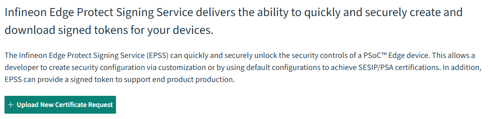
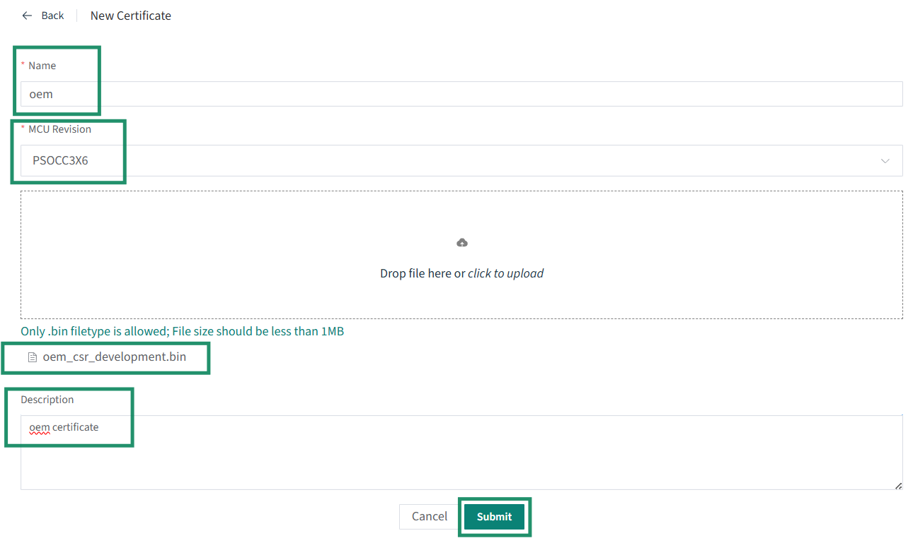
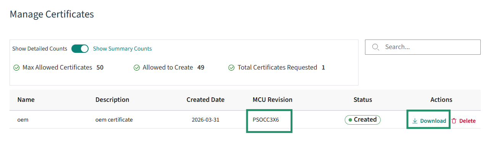

[Click here](../README.md) to view the README.

## Ownership transfer

Ownership transfer is a **prerequisite for any device provisioning**. Perform it only if you intend to provision the device — that is, to enable [secure boot of the EdgeProtect Bootloader](setup.md#3-secure-boot-of-the-edgeprotect-bootloader) or to use [KDF-CMAC encrypted update](setup.md#2-encrypted-update). It is **not** needed for the basic secure boot and update demonstration.

Before changing the policy file, transfer the device ownership to yourself using these steps:

1. Open modus-shell and navigate to the application directory

    ```
    cd <app-directory>

    ```

2. Execute the following command to initialize the tools.

    ```
    edgeprotecttools -t psoc_c3x6 init
    ```

3. Execute the following command to configure the OpenOCD tools path:

    ```
    edgeprotecttools set-ocd --name jlink --probe-type jlink --speed-khz 4000
    ```

4. Create a private and public key pair. The following command generates one pair of keys that is placed in the keys directory:

    ```
    edgeprotecttools --no-interactive-mode create-key --key-type ECDSA-P521 -o keys/oem_dev_priv_key.pem keys/oem_dev_pub_key.pem
    ```

5. To generate a new CSR, execute this command:

    ```
    edgeprotecttools -t psoc_c3x6 oem-csr --public-key-0 keys/oem_dev_pub_key.pem --public-key-1 keys/oem_dev_pub_key.pem --sign-key-0 keys/oem_dev_priv_key.pem --sign-key-1 keys/oem_dev_priv_key.pem --oem "Company Name" --project "Project Name" --project-number 12345678 --cert-type development --output keys/oem_csr_development.bin
    ```

6. Once the CSR is created, it must be signed by Infineon to create a valid OEM certificate. Follow these steps outlined to generate an Infineon signed OEM certificate.

      1. Prior to creating a certificate, you must sign up for an Infineon online software tools and services (OSTS) account. Any developer may create an OSTS account by registering at [osts.infineon.com](https://osts.infineon.com/epss/home)

      2. Once you have registered, login to your OSTS account and click on **Edge Protect Signing Service**. This will take you to a page where you can upload your Certificate Signing Request (CSR) that you created in the previous step. Click on the **Upload New Certificate Request** button. This will take you to a window where you can upload your CSR, enter a name for the certificate, and enter a description

         **Figure 1. Upload new certificate request**

         

      3. Enter the certificate name without any spaces or special characters, if you enter the name as “oem”, the generated certificate will be named “oem_cert.bin”. Select the silicon revision as **PSOCC3X6**. Next, enter the description for this certificate in the “Description” field. This description will be in the list of certs that you own, so you can easily identify one cert from another if you have more than one.

      4. Click the **Drop file here or click to upload button** to upload the CSR and navigate to the CSR that you created in the previous step instead of dropping the file in this area. In the previous steps, the path was *`<app-directory>`/keys/oem_csr_development.bin*

         **Figure 2. Uploading CSR**

         

      5. Once the name and description have been entered and the CSR has been uploaded, click the **Submit** button. This should take you back to the original page with a list of certificates under **Manage Certificates**. If the list does not show the most recent certificate generated, click on the **Refresh List**. You should now see the signed certificate ready for you to download. Click on the **Download** button on the line that contains the certificate you want to download. This will download the signed certificate to the location on your computer where the files are downloaded.

         **Figure 3. Manage certificates**

         

      > **Note:** You can revisit this website at any time and download any of the certificates that have been signed in the past. During development, you only need to perform these steps once, but you can generate multiple certificates if needed.


7. Place the certificate obtained in the *`<app-directory>`/keys/* folder as *oem_cert_development.bin*. Provision the device with the key and certificate to transfer the ownership

    ```
    edgeprotecttools -t psoc_c3x6 provision-device -p policy/policy_oem_provisioning.json --ifx-oem-cert keys/oem_cert_development.bin --key keys/oem_dev_priv_key.pem
    ```

Once ownership transfer is complete, return to the setup step you came from — [Provision the KDF-CMAC key](setup.md#25-provision-the-kdf-cmac-key-kdf-cmac-only) or [Secure boot of the EdgeProtect Bootloader](setup.md#3-secure-boot-of-the-edgeprotect-bootloader) — and continue.
